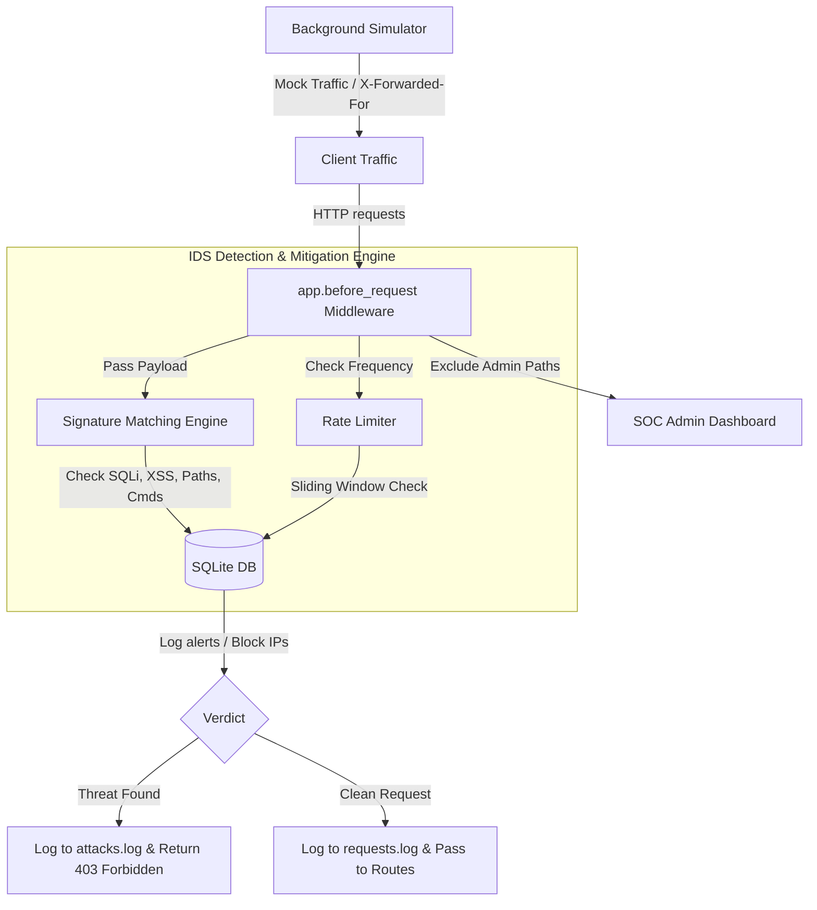

# SecurIDS - Cyber Intrusion Detection & Mitigation System

A lightweight, real-time Web Intrusion Detection System (IDS) and Intrusion Prevention System (IPS) built with **Flask**, **SQLAlchemy (SQLite)**, and **Chart.js**.

SecurIDS monitors HTTP traffic, inspects query strings, headers, and request bodies for malicious signatures, automatically bans offending IPs, rate-limits brute force attempts, and presents insights on a high-fidelity, interactive **glassmorphic dark-theme Operations Dashboard**.

---

## 🚀 Key Features

* **Multi-Layer Signature Detection**: Scans request payloads in real-time for:
  * **SQL Injection (SQLi)**: Detects pattern matches like `UNION SELECT`, `DROP TABLE`, `OR 1=1`, etc.
  * **Cross-Site Scripting (XSS)**: Filters out malicious HTML scripts, event triggers (`onerror`, `onload`), and cookie harvesting attempts.
  * **Path Traversal**: Prevents unauthorized access to local files (e.g. `../../etc/passwd`).
  * **Command Injection**: Detects shell execution tokens (e.g. `; whoami`, `&& dir`).
* **Dynamic Brute-Force Prevention**: A thread-safe sliding window rate limiter blocks IPs exceeding predefined request thresholds (20 reqs / min).
* **Glassmorphic SOC Dashboard**: Real-time admin workspace featuring:
  * Live-updating telemetry (CPU/Memory gauges).
  * Request traffic line graph (Normal vs. Attack ratio).
  * Interactive incident distribution pie chart.
  * Comprehensive Security Incident Register and Blocked IP manager (with manual unban/ban control).
* **Integrated Traffic Simulator**: Runs a background request daemon to generate realistic normal and attack packets from rotating IPs to demonstrate IPS capabilities safely.
* **Smart Admin Guardrails**: Bypasses detection checks on dashboard routes to ensure system administrators never get locked out during active incidents.

---

## 🏗️ Architecture Design



---

## 📁 Repository Structure

```text
Intrusion_Detection/
│
├── app.py                  # Main Flask Web Server & Admin REST APIs
├── security.py             # Regex threat signatures & Rate Limiter classes
├── simulator.py            # Background multi-IP normal/attack traffic generator
├── requirements.txt        # Python external dependencies list
│
├── static/
│   ├── css/
│   │   └── dashboard.css   # Dark-mode styling, glowing panels, CSS grids
│   └── js/
│       └── dashboard.js    # Chart.js rendering, toast events, and API fetch
│
├── templates/
│   └── dashboard.html      # Responsive HTML layout structures
│
├── instance/
│   └── ids.db              # SQLite Database containing logged tables (created on start)
│
├── requests.log            # Running audit log of all standard requests
└── attacks.log             # Running audit log of blocked threats
```

---

## 🛠️ Getting Started & Installation

### 1. Pre-requisites
Ensure you have Python 3.8 or higher installed on your system.

### 2. Install Dependencies
Clone the repository, navigate into the directory, and install requirements:

```bash
pip install -r requirements.txt
```

### 3. Running the Server
Run the Flask server:

```bash
python app.py
```

The application will start on **`http://localhost:5000`**.

* **Standard Site**: `http://localhost:5000/` (returns secure APIs)
* **Administrative SOC Dashboard**: `http://localhost:5000/dashboard`

---

## 🕹️ Interactive Simulation & Manual Testing

1. Open your browser and navigate to `http://localhost:5000/dashboard`.
2. Click **Start Continuous Simulation** in the *Simulator Control Center*. Watch as:
   * Traffic metrics and charts immediately spring to life.
   * Background threats (like Brute-Force and SQLi) are simulated, triggering real-time toast alerts with low-warning notification tones.
   * Malicious IPs are auto-banned and listed in the *Blocked IP Register*.
3. Click **Unblock** beside any blocked IP to immediately remove it from the blacklist.
4. (Optional) Run manual tests from your command terminal using `curl`:

**Test SQL Injection Block:**
```bash
curl -X POST http://localhost:5000/submit -d "data='; DROP TABLE users; --"
```

**Test XSS Block:**
```bash
curl "http://localhost:5000/search?q=<script>alert('hack')</script>"
```

**Test Path Traversal Block:**
```bash
curl "http://localhost:5000/download?file=../../../../etc/passwd"
```

**Test Command Injection Block:**
```bash
curl -X POST http://localhost:5000/ping -d "host=127.0.0.1; whoami"
```
